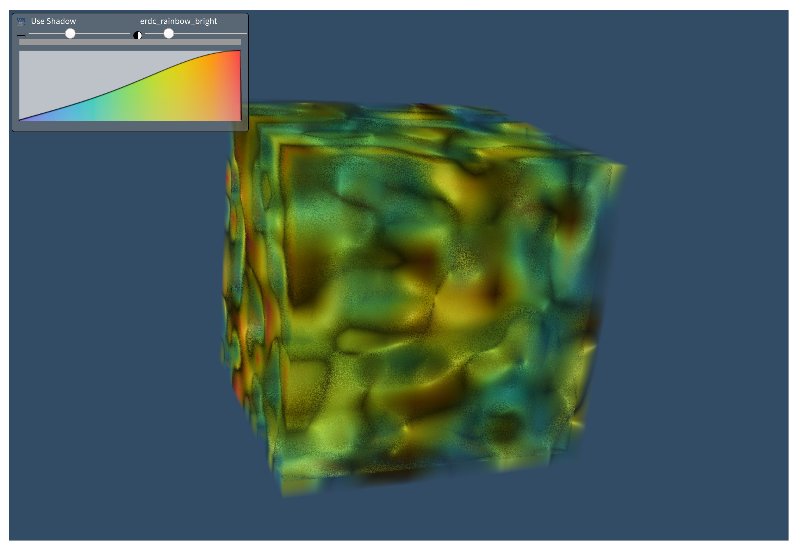

# Dash VTK

Dash VTK lets you integrate the `vtk.js` visualization pipeline directly into your Dash app. It is powered by [`react-vtk-js`](https://github.com/Kitware/react-vtk-js/).


## Getting started

### Quickstart (Python)

First, install the library through `pip`:
```
pip install dash-vtk
```

Then, create a file called `app.py` and add the following example:

```python
import dash
import dash_vtk
import dash_html_components as html

app = dash.Dash(__name__)

app.layout = html.Div(
    style={"width": "100%", "height": "calc(100vh - 16px)"},
    children=dash_vtk.View([
        dash_vtk.GeometryRepresentation([
            dash_vtk.Algorithm(
                vtkClass="vtkConeSource",
                state={"resolution": 64, "capping": False},
            )
        ]),
    ]),
)

if __name__ == "__main__":
    app.run_server(debug=True)
```

Now, simply run the app:
```
python app.py
```

For a more detailed example, see `usage.py`.

### Quickstart (R)

First, install the package from GitHub (the package is not yet available via CRAN):
```
remotes::install_github("plotly/dash-vtk")
```

then, create your component and add it to your layout:

```r
library(dash)
library(dashVtk)
library(dashHtmlComponents)

app <- Dash$new()

app$layout(htmlDiv(
    style = list("width" = "100%", "height" = "calc(100vh - 16px)"),
    children = vtkView(list(
        vtkGeometryRepresentation(
            vtkAlgorithm(
                vtkClass = "vtkConeSource",
                state = list("resolution" = 64, "capping" = FALSE),
            )
        )
    ))
))

app$run_server()
```
## Contributing

See [docs/CONTRIBUTING.md](./docs/CONTRIBUTING.md) to learn about:

* Setting up the environment
* Coding Style
* Code quality & design
* Tests
* Publishing


## Running the demos

First clone the project (replace `<name>` with the desired demo):

``` bash
git clone https://github.com/plotly/dash-vtk.git
cd dash-vtk/demos/<name>/
```

Create a venv and install the requirements:
```bash
python -m venv venv
source venv/bin/activate  # for Windows, use venv\Scripts\activate.bat
pip install -e ../../  # IMPORTANT! If you skip you will get the pip version of dash-vtk
pip install -r requirements.txt
```

Run the demo:
```bash
python app.py
```

## References

You can find the complete API reference in [`docs/REFERENCES.md`](./docs/REFERENCES.md) for each of the following components:
- [Algorithm](./docs/REFERENCES.md#Algorithm)
- [Calculator](./docs/REFERENCES.md#Calculator)
- [CellData](./docs/REFERENCES.md#CellData)
- [DataArray](./docs/REFERENCES.md#DataArray)
- [FieldData](./docs/REFERENCES.md#FieldData)
- [GeometryRepresentation](./docs/REFERENCES.md#GeometryRepresentation)
- [ImageData](./docs/REFERENCES.md#ImageData)
- [PointCloudRepresentation](./docs/REFERENCES.md#PointCloudRepresentation)
- [PointData](./docs/REFERENCES.md#PointData)
- [PolyData](./docs/REFERENCES.md#PolyData)
- [Reader](./docs/REFERENCES.md#Reader)
- [ShareDataSet](./docs/REFERENCES.md#ShareDataSet)
- [SliceRepresentation](./docs/REFERENCES.md#SliceRepresentation)
- [View](./docs/REFERENCES.md#View)
- [VolumeController](./docs/REFERENCES.md#VolumeController)
- [VolumeDataRepresentation](./docs/REFERENCES.md#VolumeDataRepresentation)
- [VolumeRepresentation](./docs/REFERENCES.md#VolumeRepresentation)


## Demos

### Usage for `dash_vtk.Algorithm`

* [Code](./demos/usage-algorithm)
* Online Demo (coming soon)


### Point Cloud with PyVista

* [Code](./demos/pyvista-point-cloud)
* Online Demo (coming soon)


### Terrain deformation using PyVista and dash-vtk

* [Code](./demos/pyvista-terrain-following-mesh)
* Online Demo (coming soon)


### Volume Rendering

* [Code](./demos/volume-rendering)
* Online Demo (coming soon)


### VTK for data processing and dash-vtk for rendering

* [Code](./demos/usage-vtk-cfd)
* Online Demo (coming soon)


### Synthetic Volume Rendering

* [Code](./demos/synthetic-volume-rendering)
* Online Demo (coming soon)


