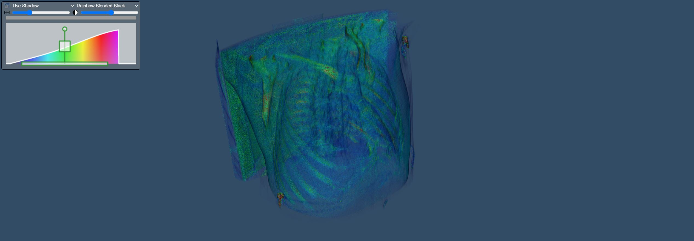

# Visualizing MRi volumes from dicom files



## Instructions

See instructions from [README.md](../../README.md) to create a virtual environment and install the dependencies.


## Acknowledgements

Dataset: [Lung CT](https://wiki.cancerimagingarchive.net/pages/viewpage.action?pageId=70224216#70224216bcab02c187174a288dbcbf95d26179e8)

```
Citation: Li, P., Wang, S., Li, T., Lu, J., HuangFu, Y., & Wang, D. (2020). A Large-Scale CT and PET/CT Dataset for Lung Cancer Diagnosis [Data set]. The Cancer Imaging Archive. https://doi.org/10.7937/TCIA.2020.NNC2-0461
```