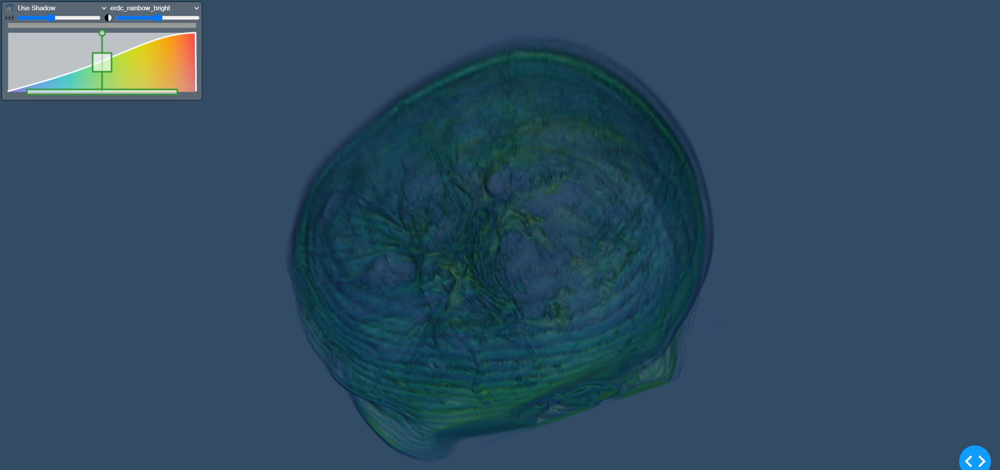

# Visualizing CT Scans as volume from dicom files



## Instructions

See instructions from [README.md](../../README.md) to create a virtual environment and install the dependencies.


## Acknowledgements

The datasets used here include:

[Brain MRI](https://wiki.cancerimagingarchive.net/display/Public/Brain-Tumor-Progression)

```
Citation: Schmainda KM, Prah M (2018). Data from Brain-Tumor-Progression. The Cancer Imaging Archive. http://doi.org/10.7937/K9/TCIA.2018.15quzvnb 
```
