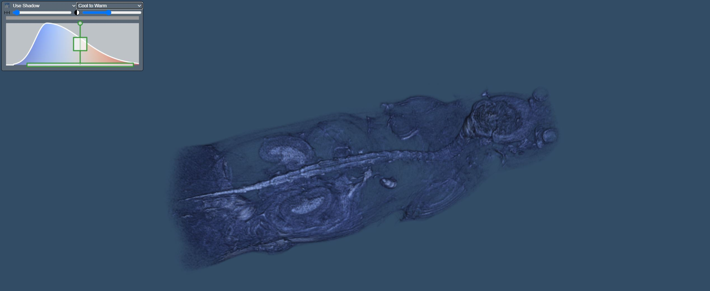

# Visualizing MRi volumes from dicom files



## Instructions

See instructions from [README.md](../../README.md) to create a virtual environment and install the dependencies.


## Acknowledgements

The datasets used here include:

[Pancreas MRI](https://wiki.cancerimagingarchive.net/display/Public/Imaging+characterization+of+a+metastatic+patient+derived+model+of+adenocarcinoma+pancreas%3A+PDMR-292921-168-R)
```
Citation: Tatum, J., Kalen, J., Ileva, lilia, L, R., S, K., N, P., Jacobs, P., Sanders, C., A, J., Difilippantonio, S., L, T., hollingshead, melinda, J, P., Y, E., Clunie, D., Y, L., Suloway, C., Smith, K., U, W., … Doroshow, J. (n.d.). Imaging characterization of a metastatic patient derived model of adenocarcinoma pancreas: PDMR-292921-168-R. The Cancer Imaging Archive. https://doi.org/10.7937/TCIA.2020.PCAK-8Z10
```