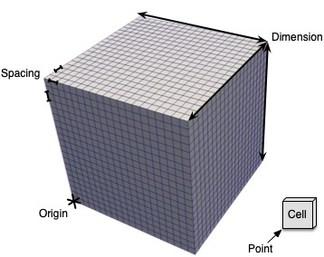
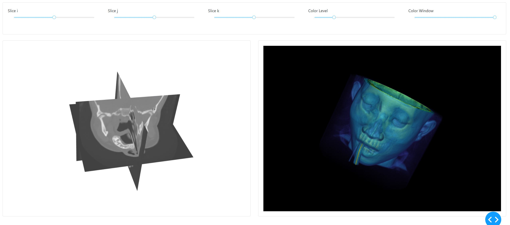

# Dash-vtk

Dash-vtk aims to integrate VTK/vtk.js visualization into the Dash framework.

[VTK](https://vtk.org/) stands for _Visualization Toolkit_ and is a popular library written in C++ which is also available in Python for doing data processing and visualization in the scientific and medical fields. Typically VTK is used to visualize 3D geometries from simulations or sensors such as LIDAR scanner. For the medical world, VTK is used to render 3D images (i.e. CT, MRI, ...) by doing volume rendering and/or slicing.

[Vtk.js](https://kitware.github.io/vtk-js/) on the other hand is a subset of VTK that focus on the rendering aspect of it but in the JavaScript world. Vtk.js takes the same architecture and object decomposition as his big brother VTK/C++ but make it frendly to use inside your browser.

Dash-vtk is enabling its users to use VTK on the server side for any data processing and provide the infrastructure to push the visualization to the client side for a better experience.
Dash-vtk do not require VTK but can seamlessly leverage it for looking at point clouds, a CFD simulation or anything 3D mesh or 3D images related.

## 3D Visualization explained

In VTK, we have 3 main types of objects that are key for understanding its visualization principals.
First we have the __View__ which is just a container for any __Representation__ of __DataSource__ that you want to see.

### View

The view is a 3D View that can do Geometry rendering for meshes or Volume rendering for 3D images.
The view can be configured to act as a 2D one when using parallel projection and preventing rotation when interacting with it. The __View__ component can be configured with the following set of properties.

```python
dash_vtk.View(
  id='vtk-view',
  background=[0, 0, 0],           # RGB array of floating point values between 0 and 1.
  interactorSettings=[...],       # Binding of mouse events to camera action (Rotate, Pan, Zoom...)
  cameraPosition=[x,y,z],         # Where the camera should be initially placed in 3D world
  cameraViewUp=[dx, dy, dz],      # Vector to use as your view up for your initial camera
  cameraParallelProjection=False, # Perspective or flat
  triggerRender=0,                # Timestamp meant to trigger a render when different
  triggerResetCamera=0,           # Timestamp meant to trigger a reset camera when different
  pickingModes=['click'],         # Listen for click and/or hover event. (Options: hover, click)
  # clickInfo,                    # Read-only property to retreive picked representation id and picking information
  # hoverInfo,                    # Read-only property to retreive picked representation id and picking information
)
```

For the __interactorSettings__ we expect a list of mouse event type linked to an action. The example below is what is used as default:

```js
interactorSettings=[
  {
    button: 1,
    action: 'Rotate',
  }, {
    button: 2,
    action: 'Pan',
  }, {
    button: 3,
    action: 'Zoom',
    scrollEnabled: true,
  }, {
    button: 1,
    action: 'Pan',
    shift: true,
  }, {
    button: 1,
    action: 'Zoom',
    alt: true,
  }, {
    button: 1,
    action: 'ZoomToMouse',
    control: true,
  }, {
    button: 1,
    action: 'Roll',
    alt: true,
    shift: true,
  }
]
```

A mouse event can be identified with the following set of properties:
 - __button__: 1/2/3       # Which button should be down
 - __shift__: True/False   # Is the `Shift` key down
 - __alt__: True/False     # Is the `Alt` key down
 - __control__: True/False # Is the `Ctrl` key down
 - __scrollEnabled__: True/False # Some action could also be trigger by scroll
 - __dragEnabled__: True/False   # Mostly used to disable default drag behavior

And the `action` could be one of the following:
 - __Pan__: Will pan the object on the plan normal to the camera
 - __Zoom__: Will zoom closer or further from the object based on the drag direction
 - __Roll__: Will rotate the object around the view direction
 - __ZoomToMouse__: Will zoom while keeping the location that was initialy under the mouse at the same spot

### Representation

A representation is responsible to convert a __DataSource__ into something visual that will be available inside the __View__.

So far we are exposing to `dash_vtk` 3 core types of __Representation__:
 - __GeometryRepresentation__: The geometry representation will expect a mesh and will render it as geometry rendering (think triangle sets).
 - __VolumeRepresentation__: The volume representation will expect a 3D image and will render it using a Volume Rendering technique that will let you see through (foggy object).
 - __SliceRepresentation__: The slice representation will expect a 3D image and will slice it along a given axis.

Representations should be put inside the children of a __View__.

### DataSource

A __DataSource__ can be many things but it is mostly something that can produce data. In other words it could be a `dataset` or a `filter` that consume some data and generate new ones or even a `reader` that will read somekind of input (file, url...) and produce some data. Any __DataSource__ can be placed inside the children of another __DataSource__ that will act as a filter or simply passed to a __Representation__.

In `dash_vtk` we have several objects that falls into that category. The list below gives you an overview of those but more details information can be found later.
 - __Algorithm__: It allow you to instanciate a vtk.js algorithm that could either be a filter (vtkWarpScalar) or a source (vtkLineSource, vtkConeSource, vtkPlaneSource, vtkSphereSource, vtkCylinderSource).
 - __ImageData__: An ImageData is what I've been calling a 3D image so far. This element will let you define each piece that compose a 3D image.
 - __PolyData__: A PolyData is a surface mesh (points, triangles...). This element will let you define the various piece of a mesh.
 - __Reader__: A reader is similar to an __Algorithm__ except that readers have a common set of API and this element let you leverage those.
 - __ShareDataSet__: This element allow you to capture any __DataSource__ and make it available into another processing pipeline or representation without duplicating the data that get sent from the server to the client.
 - __Mesh__: This element is similar to __PolyData__ except that it has a Python helper function that goes with it which will help you map a __vtkDataSet__ into a single property of the __Mesh__.
 - __Volume__: This element is similar to __ImageData__ except that it has a Python helper function that goes with it which will help you map a __vtkImageData__ into a single property of the __Volume__.

## Geometry Rendering

Now that we have those core concepts down we can show you some code on how to render a mesh using `dash-vtk`.

[code](./tutorials/t00_geometry_rendering.py)
```py
# Use helper to get a mesh structure that can be passed as-is to a Mesh
mesh_state = to_mesh_state(dataset)

content = dash_vtk.View([
    dash_vtk.GeometryRepresentation([
        dash_vtk.Mesh(state=mesh_state)
    ]),
])

# Dash setup
app = dash.Dash(__name__)
server = app.server

app.layout = html.Div(
    style={"width": "100%", "height": "calc(100vh - 15px)"},
    children=[content],
)

if __name__ == "__main__":
    app.run_server(debug=True)

```

## Volume Rendering

The previous example was using a 3D image and extracting its mesh to render. Let's keep the same data but show it as Volume Rendering.

[code](./tutorials/t01_volume_rendering.py)
```py
import dash
import dash_html_components as html

import dash_vtk
from dash_vtk.utils import to_volume_state

from vtk.vtkImagingCore import vtkRTAnalyticSource

# Use VTK to get some data
data_source = vtkRTAnalyticSource()
data_source.Update()  # <= Execute source to produce an output
dataset = data_source.GetOutput()

# Use helper to get a volume structure that can be passed as-is to a Volume
volume_state = to_volume_state(dataset)  # No need to select field

content = dash_vtk.View([
    dash_vtk.VolumeRepresentation([
        # GUI to control Volume Rendering
        # + Setup good default at startup
        dash_vtk.VolumeController(),
        # Actual volume
        dash_vtk.Volume(state=volume_state),
    ]),
])

# Dash setup
app = dash.Dash(__name__)
server = app.server

app.layout = html.Div(
    style={"width": "100%", "height": "calc(100vh - 15px)"},
    children=[content],
)

if __name__ == "__main__":
    app.run_server(debug=True)
```

## Understanding the structure of a dataset

In vtk.js because we mostly focus on Rendering we only have 2 types of data structures. We have a `vtkPolyData` that can be used for geometry rendering and a `vtkImageData` that can be used for volume rendering. In proper VTK, we have more types of DataSets and we have several filters that help you convert from one type to another.

But in our usecase here we are going to explain some of the fondation of those data structure so you could understand how you could create them by hand if you wanted to.

### ImageData

An Image data is an implicit grid that is axis aligned like shown in the picture below.



The set of properties that can be given to `ImageData` are as follow:
- __origin__: location of the bottom left corner of the grid in the 3D world
- __dimensions__: how many points we have along each axis
- __spacing__: what is the uniform spacing along each axis between the points

A concreate example would be a grid of 5 points or 4 cells along each axis which will go from `[-2, 2]` along each axis.

[code](./tutorials/t02_imagedata.py)
```py
dash_vtk.ImageData(
  dimension=[5,5,5],
  origin=[-2,-2,-2],
  spacing=[1,1,1],
)
```

### PolyData

A Poly data is a surface mesh that is composed of `points` and `cells`. A polydata can be composed of various types of cells listed below:
- __verts__: Vertex or point that we want to see as a tiny square on the screen
- __lines__: Lines that connect points into a one segment or multi segment line
- __polys__: Polygones which are convex surface such as a triangle, rectangle, circle...
- __strips__: Triangle strips is a way to combine efficiently triangles together with no repetition in points connectivity

The way cells are defined is via an index based array that map to a given point index. For example let's pretend you want to create a line that has 2 segments, you will need at least 3 points defined in the `points` array. If those points are defined first in your `points` array, then the `lines` array should be filled as follow:

```py
nb_points = 3
lines = [nb_points, 0, 1, 2]
```

In case you want to create 2 lines independant from each other, you can do it as follow:

```py
lines = [
  3, 0, 1, 2,        # First line of 2 segments / 3 points
  2, 3, 4,           # Second line of 1 segment / 2 points
  4, 10, 11, 12, 14  # Third line of 3 segments / 4 points
]
```

You can see a concreate example in the image below

[code](./tutorials/t03_polydata.py)


The `dash_vtk.PolyData` element has an additional property to automatically generate cells based on some assumption of the order of the points defined in the `points` array. That property is named __connectivity__ which default to `manual` meaning no automatic action is taken. But that property can be set to `points` to automatically set the vertex to actually see the points provided or `triangles` which assume to use 3 concecutive points to create a triangle and finally `strips` which then assume it is a single triangle strip consuming all the points.

### Fields

Having a grid is a good start, but most likely you would want to attach a field to a given mesh so you can start looking at it in a 3D context.

Fields are arrays that map to either __Points__ or __Cells__. They could be scalars or vectors of different size.

The diagram below try to explain the difference between fields located on points vs cells in term of rendering but it also trully has a different meaning based on the type of data that you have.


The example below show you how you can attach fields to a dataset (PolyData and/or ImageData).

Caution: By convention, we always attach data to points in an ImageData for doing VolumeRendering and the array must be registered as scalars.

[ImageData code](./tutorials/t02_imagedata.py) | [PolyData code](./tutorials/t03_polydata.py)
```py
dash_vtk.ImageData(
  dimensions=[5,5,5],
  origin=[-2,-2,-2],
  spacing=[1,1,1],
  children=[
    dash_vtk.PointData([
      dash_vtk.DataArray(
        registration="setScalars",
        values=range(5*5*5),
      )
    ])
  ],
)

dash_vtk.PolyData(
  points=[
    0,0,0,
    1,0,0,
    0,1,0,
    1,1,0,
  ],
  lines=[3, 1, 3, 2],
  polys=[3, 0, 1, 2],
  children=[
    dash_vtk.PointData([
      dash_vtk.DataArray(
        name='onPoints',
        values=[0, 0.33, 0.66, 1],
      )
    ]),
    dash_vtk.CellData([
      dash_vtk.DataArray(
        name='onCells',
        values=[0, 1],
      )
    ])
  ],
)
```

## Usage of elements

### GeometryRepresentation

The properties available on the __GeometryRepresentation__ let you tune the way you want to render your geometry.

In VTK a representation is composed of an [__Actor__](https://kitware.github.io/vtk-js/api/Rendering_Core_Actor.html), a [__Mapper__](https://kitware.github.io/vtk-js/api/Rendering_Core_Mapper.html) and a [__Property__](https://kitware.github.io/vtk-js/api/Rendering_Core_Property.html). Each of those object can be configured using the __actor__, __mapper__ and __property__ arguments of the __GeometryRepresentation__.

The list below show you the default values used for each argument:

  - __actor__:
    - origin = (0,0,0)
    - position = (0,0,0)
    - scale = (1,1,1)
    - visibility = 1
    - pickable = 1
    - dragable = 1
    - orientation = (0,0,0)
  - __property__:
    - lighting = true
    - interpolation = [Interpolation.GOURAUD](https://github.com/Kitware/vtk-js/blob/master/Sources/Rendering/Core/Property/Constants.js#L1-L5)
    - ambient = 0
    - diffuse = 1
    - specular = 0
    - specularPower = 1
    - opacity = 1
    - edgeVisibility = false
    - lineWidth = 1
    - pointSize = 1
    - backfaceCulling = false
    - frontfaceCulling = false
    - representation = [Representation.SURFACE](https://github.com/Kitware/vtk-js/blob/master/Sources/Rendering/Core/Property/Constants.js#L7-L11)
    - color = (1,1,1)          # White
    - ambientColor = (1,1,1)
    - specularColor = (1,1,1)
    - diffuseColor = (1,1,1)
    - edgeColor = (0,0,0)      # Black
  - __mapper__:
    - static = false
    - scalarVisibility = true
    - scalarRange = [0, 1]
    - useLookupTableScalarRange = false
    - colorMode = 0 ([Available values](https://github.com/Kitware/vtk-js/blob/master/Sources/Rendering/Core/Mapper/Constants.js#L1-L5))
    - scalarMode = 0 ([Available values](https://github.com/Kitware/vtk-js/blob/master/Sources/Rendering/Core/Mapper/Constants.js#L7-L14))
    - arrayAccessMode = 1 ([Available values](https://github.com/Kitware/vtk-js/blob/master/Sources/Rendering/Core/Mapper/Constants.js#L16-L19))
    - colorByArrayName = ''
    - interpolateScalarsBeforeMapping = false
    - useInvertibleColors = false
    - fieldDataTupleId = -1
    - viewSpecificProperties = None
    - customShaderAttributes = []

On top of those previous settings we provide additional properties to configure a lookup table using one of our available [__colorMapPreset__](https://github.com/Kitware/vtk-js/blob/master/Sources/Rendering/Core/ColorTransferFunction/ColorMaps.json) and a convinient __colorDataRange__ to rescale to color map to your area of focus.

With the GeometryRepresentation you also have the option to turn on the CubeAxes using the `showCubeAxes=True` along with additional configuration parameters that can be provided via `cubeAxesStyle` property. The content of the object for __cubeAxesStyle__ can be found in the source code of vtk.js from the [default section here](https://github.com/Kitware/vtk-js/blob/HEAD/Sources/Rendering/Core/CubeAxesActor/index.js#L703-L719).
### GlyphRepresentation

GlyphRepresentation let you use a source as a Glyph which will then be cloned and position at every points of another source. The properties available on the __GlyphRepresentation__ let you tune the way you want to render your geometry.

In VTK a representation is composed of an [__Actor__](https://kitware.github.io/vtk-js/api/Rendering_Core_Actor.html), a [__Mapper__](https://kitware.github.io/vtk-js/api/Rendering_Core_Glyph3DMapper.html) and a [__Property__](https://kitware.github.io/vtk-js/api/Rendering_Core_Property.html). Each of those object can be configured using the __actor__, __mapper__ and __property__ arguments of the __GlyphRepresentation__.

The list below show you the default values used for each argument:

  - __actor__:
    - origin = (0,0,0)
    - position = (0,0,0)
    - scale = (1,1,1)
    - visibility = 1
    - pickable = 1
    - dragable = 1
    - orientation = (0,0,0)
  - __property__:
    - lighting = true
    - interpolation = [Interpolation.GOURAUD](https://github.com/Kitware/vtk-js/blob/master/Sources/Rendering/Core/Property/Constants.js#L1-L5)
    - ambient = 0
    - diffuse = 1
    - specular = 0
    - specularPower = 1
    - opacity = 1
    - edgeVisibility = false
    - lineWidth = 1
    - pointSize = 1
    - backfaceCulling = false
    - frontfaceCulling = false
    - representation = [Representation.SURFACE](https://github.com/Kitware/vtk-js/blob/master/Sources/Rendering/Core/Property/Constants.js#L7-L11)
    - color = (1,1,1)          # White
    - ambientColor = (1,1,1)
    - specularColor = (1,1,1)
    - diffuseColor = (1,1,1)
    - edgeColor = (0,0,0)      # Black
  - __mapper__:
    - orient = true
    - orientationMode = 0 ([Available values](https://github.com/Kitware/vtk-js/blob/master/Sources/Rendering/Core/Glyph3DMapper/Constants.js#L1-L5))
    - orientationArray = null
    - scaling = true
    - scaleFactor = 1.0
    - scaleMode = 1 ([Available values](https://github.com/Kitware/vtk-js/blob/master/Sources/Rendering/Core/Glyph3DMapper/Constants.js#L7-L11))
    - scaleArray = null
    - static = false
    - scalarVisibility = true
    - scalarRange = [0, 1]
    - useLookupTableScalarRange = false
    - colorMode = 0 ([Available values](https://github.com/Kitware/vtk-js/blob/master/Sources/Rendering/Core/Mapper/Constants.js#L1-L5))
    - scalarMode = 0 ([Available values](https://github.com/Kitware/vtk-js/blob/master/Sources/Rendering/Core/Mapper/Constants.js#L7-L14))
    - arrayAccessMode = 1 ([Available values](https://github.com/Kitware/vtk-js/blob/master/Sources/Rendering/Core/Mapper/Constants.js#L16-L19))
    - colorByArrayName = ''
    - interpolateScalarsBeforeMapping = false
    - useInvertibleColors = false
    - fieldDataTupleId = -1
    - viewSpecificProperties = None
    - customShaderAttributes = []

On top of those previous settings we provide additional properties to configure a lookup table using one of our available [__colorMapPreset__](https://github.com/Kitware/vtk-js/blob/master/Sources/Rendering/Core/ColorTransferFunction/ColorMaps.json) and a convinient __colorDataRange__ to rescale to color map to your area of focus.

An example of the __GlyphRepresentation__ could be for creating a spicky sphere by positioning cones normal to the sphere.

```python
def Example():
    return dash_vtk.View(
      children=[
        dash_vtk.GlyphRepresentation(
            mapper={'orientationArray': 'Normals'}
            children=[
                dash_vtk.Algorithm(
                    port=0,
                    vtkClass='vtkSphereSource',
                    state={
                        'phiResolution': 10,
                        'thetaResolution': 20,
                    },
                ),
                dash_vtk.Algorithm(
                    port=1,
                    vtkClass='vtkConeSource'
                    state={
                        'resolution': 30,
                        'height': 0.25,
                        'radius': 0.08,
                    },
                ),
            ]
        )
      ]
    )
```

### VolumeRepresentation

The properties available on the __VolumeRepresentation__ let you tune the way you want to render your volume.

In VTK a representation is composed of an [__Volume__](https://kitware.github.io/vtk-js/api/Rendering_Core_Volume.html), a [__Mapper__](https://kitware.github.io/vtk-js/api/Rendering_Core_VolumeMapper.html) and a [__Property__](https://kitware.github.io/vtk-js/api/Rendering_Core_VolumeProperty.html). Each of those object can be configured using the __actor__, __mapper__ and __property__ arguments of the __GeometryRepresentation__.


The list below show you the default values used for each argument:

  - __volume__:
    - origin = (0,0,0)
    - position = (0,0,0)
    - scale = (1,1,1)
    - visibility = 1
    - pickable = 1
    - dragable = 1
    - orientation = (0,0,0)
  - __property__:
    - independentComponents = true
    - interpolationType = [InterpolationType.FAST_LINEAR](https://github.com/Kitware/vtk-js/blob/master/Sources/Rendering/Core/VolumeProperty/Constants.js#L1-L5)
    - shade = 0
    - ambient = 0.1
    - diffuse = 0.7
    - specular = 0.2
    - specularPower = 10.0
    - useLabelOutline = false
    - labelOutlineThickness = 1
    - useGradientOpacity = [idx, value]
    - scalarOpacityUnitDistance = [idx, value]
    - gradientOpacityMinimumValue = [idx, value]
    - gradientOpacityMinimumOpacity = [idx, value]
    - gradientOpacityMaximumValue = [idx, value]
    - gradientOpacityMaximumOpacity = [idx, value]
    - opacityMode = [idx, [value](https://github.com/Kitware/vtk-js/blob/master/Sources/Rendering/Core/VolumeProperty/Constants.js#L7-L10)]
  - __mapper__:
    - sampleDistance = 1.0
    - imageSampleDistance = 1.0
    - maximumSamplesPerRay = 1000
    - autoAdjustSampleDistances = true
    - blendMode = [BlendMode.COMPOSITE_BLEND](https://github.com/Kitware/vtk-js/blob/master/Sources/Rendering/Core/VolumeMapper/Constants.js#L1-L6)
    - averageIPScalarRange = [-1000000.0, 1000000.0]

On top of those previous settings we provide additional properties to configure a lookup table using one of our available [__colorMapPreset__](https://github.com/Kitware/vtk-js/blob/master/Sources/Rendering/Core/ColorTransferFunction/ColorMaps.json) and a convinient __colorDataRange__ to rescale to color map to your area of focus.

Because it can be combersome and difficult to properly configure your volume rendering properties, it is convinient to add as first child to that representation a __VolumeController__ which will give you a UI to drive some of those parameters while also providing better defaults for your ImageData.

#### VolumeController

The __VolumeController__ provide a convinient UI element to control your Volume Rendering settings and can be tuned with the following set of properties:

- __size__: [width, height] in pixel for the controller UI
- __rescaleColorMap__: true/false to use the opacity piecewise function to dynamically rescale the color map or keep the full data range as color range.

### SliceRepresentation

The __SliceRepresentation__ let you see a slice within a 3D image. That slice can be along i,j,k or x,y,z if your volume contains an orientation matrix.

The following set of properties let you pick which slice you want to see. Only 1 of those property can be used at a time.

- __iSlice__, __jSlice__, __kSlice__: Index based slicing
- __xSlice__, __ySlice__, __zSlice__: World coordinate slicing

Then we have the standard representation set or properties with their defaults:

  - [__actor__](https://kitware.github.io/vtk-js/api/Rendering_Core_ImageSlice.html):
    - origin = (0,0,0)
    - position = (0,0,0)
    - scale = (1,1,1)
    - visibility = 1
    - pickable = 1
    - dragable = 1
    - orientation = (0,0,0)
  - [__property__](https://kitware.github.io/vtk-js/api/Rendering_Core_ImageProperty.html):
    - independentComponents = false
    - interpolationType = [InterpolationType.LINEAR](https://github.com/Kitware/vtk-js/blob/master/Sources/Rendering/Core/ImageProperty/Constants.js#L1-L4)
    - colorWindow = 255
    - colorLevel = 127.5
    - ambient = 1.0
    - diffuse = 0.0
    - opacity = 1.0
  - [__mapper__](https://kitware.github.io/vtk-js/api/Rendering_Core_ImageMapper.html):
    - customDisplayExtent: [0, 0, 0, 0]
    - useCustomExtents: false
    - slice: 0
    - slicingMode: [SlicingMode.NONE](https://github.com/Kitware/vtk-js/blob/master/Sources/Rendering/Core/ImageMapper/Constants.js#L1-L9)
    - closestIJKAxis: { ijkMode: [SlicingMode.NONE](https://github.com/Kitware/vtk-js/blob/master/Sources/Rendering/Core/ImageMapper/Constants.js#L1-L9), flip: false }
    - renderToRectangle: false
    - sliceAtFocalPoint: false

### PointCloudRepresentation

The __PointCloudRepresentation__ is just a helper using the following structure to streamline rendering a point cloud dataset. The code snippet below is not fully accurate but it should provide you with some understanding of the kind of simplification that is happening under the hood.

```python
def PointCloudRepresentation(**kwargs):
  return dash_vtk.GeometryRepresentation(
    id=kwargs.get('id'),
    colorMapPreset=kwargs.get('colorMapPreset'),
    colorDataRange=kwargs.get('colorDataRange'),
    property=kwargs.get('property'),
    children=[
      dash_vtk.PolyData(
        points=kwargs.get('xyz'),
        connectivity='points',
        children=[
          dash_vtk.PointData([
            dash_vtk.DataArray(
              registration='setScalars',
              values={kwargs.get('scalars')}
            )
          ])
        ],
      )
    ],
  )
```

The set of convinient properties are as follow:
- __xyz__ = list of xyz of each point inside a flat array
- __colorMapPreset__ = color preset name to use
- __colorDataRange__ = rescale color map to provided that range
- __property__ = {} # Same as GeometryRepresentation/property
- __rgb__ / __rgba__ / __scalars__ = [...] let you define the field you want to color your point cloud with. The rgb(a) expect numbers up to 255 for each component of Red Green Blue Alpha.

### VolumeDataRepresentation

The __VolumeDataRepresentation__ is just a helper using the following structure to streamline rendering a volume. The code snippet below is not fully accurate but it should provide you with some understanding of the kind of simplification that is happening under the hood.

```python
def VolumeDataRepresentation(**kwargs):
  return dash_vtk.VolumeRepresentation(
      id=kwargs.get('id'),
      colorMapPreset=kwargs.get('colorMapPreset'),
      colorDataRange=kwargs.get('colorDataRange'),
      property=kwargs.get('property'),
      mapper=kwargs.get('mapper'),
      volume=kwargs.get('volume'),
      children=[
          dash_vtk.VolumeController(
              rescaleColorMap=kwargs.get('rescaleColorMap'),
              size=kwargs.get('size'),
          ),
          dash_vtk.ImageData(
              dimensions=kwargs.get('dimensions'),
              origin=kwargs.get('origin'),
              spacing=kwargs.get('spacing'),
              children=[
                  dash_vtk.PointData([
                      dash_vtk.DataArray(
                        registration='setScalars',
                        values=kwargs.get('scalars'),
                      )
                  ])
              ],
          ),
        ],
      )
    ],
  )
```

The set of convinient properties are as follow:
- __dimensions__: Number of points along x, y, z
- __spacing__: Spacing along x, y, z between points in world
- __origin__: World coordinate of the lower left corner of your vtkImageData (i=0, j=0, k=0).
- __rgb__: Use RGB values to attach to the points/vertex
- __rgba__: Use RGBA values to attach to the points/vertex
- __scalars__: Field values to attach to the points
- __scalarsType__: Types of numbers provided in scalars (i.e. Float32Array, Uint8Array, ...)
- __mapper__: Properties to set to the mapper
- __volume__: Properties to set to the volume
- __property__: Properties to set to the volume.property
- __colorMapPreset__: Preset name for the lookup table color map
- __volumeController__: Show volumeController
- __controllerSize__: Controller size in pixels
- __rescaleColorMap__: Use opacity range to rescale color map

### Mesh

This element is a helper on top of __PolyData__ which has a Python helper function that goes with it which will help you map a __vtkDataSet__ into a single property of the __Mesh__ element.

```py
def Mesh(**kwargs):
    return dash_vtk.PolyData(
        **kwargs.get('state').get('mesh'),
        children=[
            dash_vtk.[kwargs.get('state').get('field').get('location')]([
                dash_vtk.DataArray(
                  **kwargs.get('state').get('field'),
                )
            ])
        ]
    )
```

The __Mesh__ element expect a single __state__ property that is internaly split into 2 elements to represent the geometry and the field that you want to optionally attach to your mesh. The structure could be defined as follow:

- __state__
  - mesh: (Contains the properties of __PolyData__)
    - points = []
    - verts = []
    - lines = []
    - polys = []
    - strips = []
    - connectivity = 'manual' # [manual, points, triangles, strips]
  - field: (Contains the properties of __DataArray__)
    - location: 'PointData' / 'CellData'
    - name: Name of the field (optional)
    - values: Array of values for the field
    - numberOfComponents: Number of components per point/cell
    - type: Name of TypedArray to use (Uint8Array, Int8Array, Float32Array, Float64Array...)

### Volume

This element is a helper on top of __ImageData__ which has a Python helper function that goes with it which will help you map a __vtkImageData__ into a single property of the __Volume__ element.

```py
def Volume(**kwargs):
    return dash_vtk.ImageData(
        **kwargs.get('state').get('image'),
        children=[
            dash_vtk.PointData([
                dash_vtk.DataArray(
                  **kwargs.get('state').get('field'),
                )
            ])
        ]
    )
```

The __Volume__ element expect a single __state__ property that is internaly split into 2 elements to represent the geometry and the field that you want to optionally attach to your mesh. The structure could be defined as follow:

- __state__
  - image: (Contains the properties of __ImageData__)
    - dimensions
    - spacing
    - origin
    - direction
  - field: (Contains the properties of __DataArray__)
    - values: Array of values for the field
    - numberOfComponents: Number of components per point/cell
    - type: Name of TypedArray to use (Uint8Array, Int8Array, Float32Array, Float64Array...)

### Algorithm

This element allow you to create and configure a vtk.js class. This element expect only 2 properties:
- __vtkClass__: The name of the vtkClass to instantiate.
- __state__: The set of properties to apply on the given vtkClass.

The current [list of classes](https://github.com/Kitware/react-vtk-js/blob/master/src/AvailableClasses.js#L4-L15) that could be instantiate are as follow:

- __vtkClass__:
  - [vtkConcentricCylinderSource](https://kitware.github.io/vtk-js/api/Filters_Sources_ConcentricCylinderSource.html)
  - [vtkConeSource](https://kitware.github.io/vtk-js/api/Filters_Sources_ConeSource.html)
  - [vtkCubeSource](https://kitware.github.io/vtk-js/api/Filters_Sources_CubeSource.html)
  - [vtkCylinderSource](https://kitware.github.io/vtk-js/api/Filters_Sources_CylinderSource.html)
  - [vtkLineSource](https://kitware.github.io/vtk-js/api/Filters_Sources_LineSource.html)
  - [vtkPlaneSource](https://kitware.github.io/vtk-js/api/Filters_Sources_PlaneSource.html)
  - [vtkPointSource](https://kitware.github.io/vtk-js/api/Filters_Sources_PointSource.html)
  - [vtkSphereSource](https://kitware.github.io/vtk-js/api/Filters_Sources_SphereSource.html)
  - [vtkWarpScalar](https://kitware.github.io/vtk-js/api/Filters_General_WarpScalar.html)
- __state__: You will have to look on which property is available for your selected vtkClass.

The following example use a vtk source in vtk.js to generate a mesh

[code](./tutorials/t04_algorithm.py)
```py
import os
import dash
import dash_html_components as html

import dash_vtk

content = dash_vtk.View([
    dash_vtk.GeometryRepresentation(
        mapper={
            'colorByArrayName': 'layer',
            'scalarMode': 4,
            'interpolateScalarsBeforeMapping': False,
        },
        colorMapPreset="jet",
        colorDataRange=[0.2, 0.9],
        children=[
          dash_vtk.Algorithm(
              vtkClass="vtkConcentricCylinderSource",
              state={
                  'height': 0.25,
                  'radius': [0.2, 0.3, 0.4, 0.6, 0.7, 0.8, 0.9, 1],
                  'cellFields': [0, 0.2, 0.4, 0.6, 0.7, 0.8, 0.9, 1],
                  'mask': [1, 0, 1, 0, 1, 0, 1, 1],
                  'resolution': 60,
                  'skipInnerFaces': True,
                  'startTheta': 45,
                  'endTheta': 315,
                  'center': [0, 0, 0.5],
              },
          ),
        ]
    ),
])

# Dash setup
app = dash.Dash(__name__)
server = app.server

app.layout = html.Div(
    style={"width": "100%", "height": "calc(100vh - 15px)"},
    children=[content],
)

if __name__ == "__main__":
    app.run_server(debug=True)
```


### Reader

This element is similar to the __Algorithm__ one except that it focus on vtk.js readers by allowing to leverage their custom API.
A reader expect like an __Algorithm__ a __vtkClass__ among the one [listed below](https://github.com/Kitware/react-vtk-js/blob/master/src/AvailableClasses.js#L17-L24):

- __vtkClass__
  - vtkPLYReader
  - vtkSTLReader
  - vtkElevationReader
  - vtkOBJReader
  - vtkPDBReader
  - vtkXMLImageDataReader
  - vtkXMLPolyDataReader

Then you should use one of the property below to feed the reader with some data:
- __url__: set of url to fetch data from (on the JS side)
- __parseAsText__: set the text content to process
- __parseAsArrayBuffer__: set binary data to process from base64 string

Since the data loading is going to be asynchronous we've enabled some automatic callback to either trigger a _render_ or a _resetCamera_ once the data became available. To enable those callback, just set the following set of properties to your licking:
- __renderOnUpdate__: True (default)
- __resetCameraOnUpdate__: True (default)


[code](./tutorials/t05_reader.py)
```py
import os
import base64
import dash
import dash_html_components as html

import dash_vtk

# Data file path
files = ['cow-nonormals.obj', 'pumpkin_tall_10k.obj', 'teapot.obj', 'teddy.obj']
root_repo_path = os.path.dirname(os.path.dirname(os.path.dirname(os.path.abspath(__file__))))
obj_file = os.path.join(root_repo_path, "demos", "data", files[0])

txt_content = None
with open(obj_file, 'r') as file:
  txt_content = file.read()

content = dash_vtk.View([
    dash_vtk.GeometryRepresentation([
        dash_vtk.Reader(
            vtkClass="vtkOBJReader",
            parseAsText=txt_content,
        ),
    ]),
])

# Dash setup
app = dash.Dash(__name__)
server = app.server

app.layout = html.Div(
    style={"width": "100%", "height": "calc(100vh - 15px)"},
    children=[content],
)

if __name__ == "__main__":
    app.run_server(debug=True)

```


### ShareDataSet

This element does not affect the dataset or else, but it allow the JavaScript side to reuse an existing __vtkDataSet__ for another __Representation__ or __filter__.

The only property expected in a __ShareDataSet__ is a name to properly reference it accross various location. By default a __name__ is provided so, in the case of only one _dataset_, you would not even need to specify such property.

The following example show how you can create a view with 1 __Volume__ and 4 representation of it.

[code](./tutorials/t06_shared_dataset.py)
```py
import dash
import dash_html_components as html

import dash_vtk
from dash_vtk.utils import to_volume_state

from vtk.vtkImagingCore import vtkRTAnalyticSource

# Use VTK to get some data
data_source = vtkRTAnalyticSource()
data_source.Update()  # <= Execute source to produce an output
dataset = data_source.GetOutput()

# Use helper to get a volume structure that can be passed as-is to a Volume
volume_state = to_volume_state(dataset)  # No need to select field

content = dash_vtk.View([
    dash_vtk.VolumeRepresentation([
        # GUI to control Volume Rendering
        # + Setup good default at startup
        dash_vtk.VolumeController(),
        # Actual volume
        dash_vtk.ShareDataSet([
            dash_vtk.Volume(state=volume_state),
        ]),
    ]),
    dash_vtk.SliceRepresentation(
        iSlice=10,
        children=[
            dash_vtk.ShareDataSet(),
        ]
    ),
    dash_vtk.SliceRepresentation(
        jSlice=10,
        children=[
            dash_vtk.ShareDataSet(),
        ]
    ),
    dash_vtk.SliceRepresentation(
        kSlice=10,
        children=[
            dash_vtk.ShareDataSet(),
        ]
    ),
])

# Dash setup
app = dash.Dash(__name__)
server = app.server

app.layout = html.Div(
    style={"width": "100%", "height": "calc(100vh - 15px)"},
    children=[content],
)

if __name__ == "__main__":
    app.run_server(debug=True)
```

## More advanced demos

__dash_vtk__ provides several advanced examples that should re-enforce what has been described so far.

We've converted several examples from [PyVista](https://docs.pyvista.org/) to show you how to enable rendering on the client side using __dash_vtk__.

Then we made several example using plain VTK for both a CFD example and some medical ones.

### Point Cloud creation

[dash_vtk](https://github.com/plotly/dash-vtk/blob/master/demos/pyvista-point-cloud/app.py) | [PyVista](https://docs.pyvista.org/examples/00-load/create-point-cloud.html)


### Terrain following mesh

[dash_vtk](https://github.com/plotly/dash-vtk/blob/master/demos/pyvista-terrain-following-mesh/app.py) | [PyVista](https://docs.pyvista.org/examples/00-load/terrain-mesh.html)


### VTK dynamic streamlines Example

This example leverage plain VTK on the server side while providing UI controls in __dash__ and leverage __dash_vtk__ to enable local rendering of dynamically computed streamlines inside a wind-tunnel.

[dash_vtk](https://github.com/plotly/dash-vtk/blob/master/demos/usage-vtk-cfd/app.py)


### Medical examples

[Real medical image](https://github.com/plotly/dash-vtk/blob/master/demos/volume-rendering/app.py)


[Randomly generated volume](https://github.com/plotly/dash-vtk/blob/master/demos/synthetic-volume-rendering/app.py)


[Multi-View with slicing](https://github.com/plotly/dash-vtk/blob/master/demos/slice-rendering/app.py)


