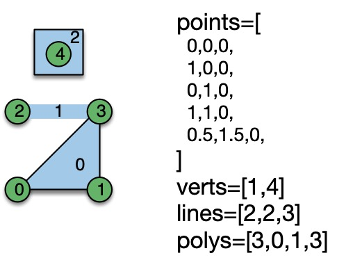
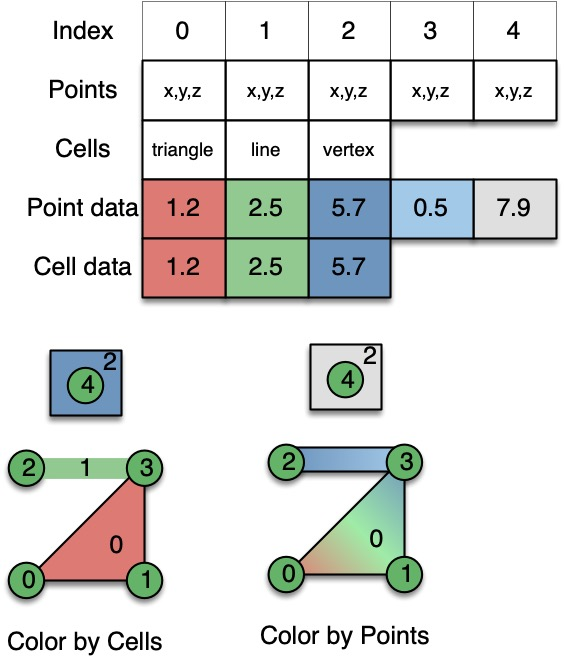

# Dash-vtk

Dash-vtk aims to integrate VTK/vtk.js visualization into the Dash framework.

[VTK](https://vtk.org/) stands for _Visualization Toolkit_ and is a popular library written in C++ which is also available in Python for doing data processing and visualization in the scientific and medical fields. Typically VTK is used to visualize 3D geometries from simulations or sensors such as LIDAR scanner. For the medical world, VTK is used to render 3D images (i.e. CT, MRI, ...) by doing volume rendering and/or slicing.

[Vtk.js](https://kitware.github.io/vtk-js/) on the other hand is a subset of VTK that focus on the rendering aspect of it but in the JavaScript world. Vtk.js takes the same architecture and object decomposition as his big brother VTK/C++ but make it frendly to use inside your browser.

Dash-vtk is enabling its users to use VTK on the server side for any data processing and provide the infrastructure to push the visualization to the client side for a better experience.
Dash-vtk do not require VTK but can seamlessly leverage it for looking at point clouds, a CFD simulation or anything 3D mesh or 3D images related.

## 3D Visualization explained

In VTK, we have 3 main types of objects that are key for understanding its visualization principals.
First we have the _View_ which is just a container for any _Representation_ of _DataSource_ that you want to see.

### View

The view is a 3D View that can do Geometry rendering for meshes or Volume rendering for 3D images.
The view can be configured to act as a 2D one when using parallel projection and preventing rotation when interacting with it. The _View_ component can be configured with the following set of properties.

```python
dash_vtk.View(
  id='vtk-view',
  background=[0, 0, 0],           # RGB array of floating point values between 0 and 1.
  interactorSettings=[...],       # Binding of mouse events to camera action (Rotate, Pan, Zoom...)
  cameraPosition=[x,y,z],         # Where the camera should be initially placed in 3D world
  cameraViewUp=[dx, dy, dz],      # Vector to use as your view up for your initial camera
  cameraParallelProjection=False, # Should we see our 3D work with perspective or flat with no depth perception
  triggerRender=0,                # Timestamp meant to trigger a render when different
  triggerResetCamera=0,           # Timestamp meant to trigger a reset camera when different
)
```

For the `interactorSettings` we expect a list of mouse event type linked to an action. The example below is what is used as default:

```js
interactorSettings=[
  {
    button: 1,
    action: 'Rotate',
  }, {
    button: 2,
    action: 'Pan',
  }, {
    button: 3,
    action: 'Zoom',
    scrollEnabled: true,
  }, {
    button: 1,
    action: 'Pan',
    shift: true,
  }, {
    button: 1,
    action: 'Zoom',
    alt: true,
  }, {
    button: 1,
    action: 'ZoomToMouse',
    control: true,
  }, {
    button: 1,
    action: 'Roll',
    alt: true,
    shift: true,
  }
]
```

A mouse event can be identified with the following set of properties:
 - button: 1/2/3       # Which button should be down
 - shift: True/False   # Is the `Shift` key down
 - alt: True/False     # Is the `Alt` key down
 - control: True/False # Is the `Ctrl` key down
 - scrollEnabled: True/False # Some action could also be trigger by scroll
 - dragEnabled: True/False   # Mostly used to disable default drag behavior

And the `action` could be one of the following:
 - Pan: Will pan the object on the plan normal to the camera
 - Zoom: Will zoom closer or further from the object based on the drag direction
 - Roll: Will rotate the object around the view direction
 - ZoomToMouse: Will zoom while keeping the location that was initialy under the mouse at the same spot

### Representation

A representation is responsible to convert a _DataSource_ into something visual that will be available inside the _View_.

So far we are exposing to `dash_vtk` 3 core types of _Representation_:
 - `GeometryRepresentation`: The geometry representation will expect a mesh and will render it as geometry rendering (think triangle sets).
 - `VolumeRepresentation`: The volume representation will expect a 3D image and will render it using a Volume Rendering technique that will let you see through (foggy object).
 - `SliceRepresentation`: The slice representation will expect a 3D image and will slice it along a given axis.

Representations should be put inside the children of a _View_.

### DataSource

A _DataSource_ can be many things but it is mostly something that can produce data. In other words it could be a `dataset` or a `filter` that consume some data and generate new ones or even a `reader` that will read somekind of input (file, url...) and produce some data. Any _DataSource_ can be placed inside the children of another _DataSource_ that will act as a filter or simply passed to a _Representation_.

In `dash_vtk` we have several objects that falls into that category. The list below gives you an overview of those but more details information can be found later.
 - `Algorithm`: It allow you to instanciate a vtk.js algorithm that could either be a filter (vtkWarpScalar) or a source (vtkLineSource, vtkConeSource, vtkPlaneSource, vtkSphereSource, vtkCylinderSource).
 - `ImageData`: An ImageData is what I've been calling a 3D image so far. This element will let you define each piece that compose a 3D image.
 - `PolyData`: A PolyData is a surface mesh (points, triangles...). This element will let you define the various piece of a mesh.
 - `Reader`: A reader is similar to an _Algorithm_ except that readers have a common set of API and this element let you leverage those.
 - `ShareDataSet`: This element allow you to capture any _DataSource_ and make it available into another processing pipeline or representation without duplicating the data that get sent from the server to the client.
 - `Mesh`: This element is similar to `PolyData` except that it has a Python helper function that goes with it which will help you map a `vtkDataSet` into a single property of the `Mesh`.
 - `Volume`: This element is similar to `ImageData` except that it has a Python helper function that goes with it which will help you map a `vtkImageData` into a single property of the `Volume`.

## Geometry Rendering

Now that we have those core concepts down we can show you some code on how to render a mesh using `dash-vtk`.

```py
# Use helper to get a mesh structure that can be passed as-is to a Mesh
# RTData is the name of the field
mesh_state = to_mesh_state(dataset)

content = dash_vtk.View([
    dash_vtk.GeometryRepresentation([
        dash_vtk.Mesh(state=mesh_state)
    ]),
])

# Dash setup
app = dash.Dash(__name__)
server = app.server

app.layout = html.Div(
    style={"width": "100%", "height": "calc(100vh - 15px)"},
    children=[content],
)

if __name__ == "__main__":
    app.run_server(debug=True)

```

## Volume Rendering

The previous example was using a 3D image and extracting its mesh to render. Let's keep the same data but show it as Volume Rendering.

```py
import dash
import dash_html_components as html

import dash_vtk
from dash_vtk.utils import to_volume_state

import vtk

# Use VTK to get some data
data_source = vtk.vtkRTAnalyticSource()
data_source.Update()  # <= Execute source to produce an output
dataset = data_source.GetOutput()

# Use helper to get a volume structure that can be passed as-is to a Volume
volume_state = to_volume_state(dataset)  # No need to select field

content = dash_vtk.View([
    dash_vtk.VolumeRepresentation([
        # GUI to control Volume Rendering
        # + Setup good default at startup
        dash_vtk.VolumeController(),
        # Actual volume
        dash_vtk.Volume(state=volume_state),
    ]),
])

# Dash setup
app = dash.Dash(__name__)
server = app.server

app.layout = html.Div(
    style={"width": "100%", "height": "calc(100vh - 15px)"},
    children=[content],
)

if __name__ == "__main__":
    app.run_server(debug=True)
```

## Understanding the structure of a dataset

In vtk.js because we mostly focus on Rendering we only have 2 types of data structures. We have a `vtkPolyData` that can be used for geometry rendering and a `vtkImageData` that can be used for volume rendering. In proper VTK, we have more types of DataSets and we have several filters that help you convert from one type to another.

But in our usecase here we are going to explain some of the fondation of those data structure so you could understand how you could create them by hand if you wanted to.

### ImageData

An Image data is an implicit grid that is axis aligned like shown in the picture below.


The set of properties that can be given to `ImageData` are as follow:
- origin: location of the bottom left corner of the grid in the 3D world
- dimensions: how many points we have along each axis
- spacing: what is the uniform spacing along each axis between the points

A concreate example would be a grid of 5 points or 4 cells along each axis which will go from `[-2, 2]` along each axis.

```py
dash_vtk.ImageData(
  dimension=[5,5,5],
  origin=[-2,-2,-2],
  spacing=[1,1,1],
)
```

### PolyData

A Poly data is a surface mesh that is composed of `points` and `cells`. A polydata can be composed of various types of cells listed below:
- `verts`: Vertex or point that we want to see as a tiny square on the screen
- `lines`: Lines that connect points into a one segment or multi segment line
- `polys`: Polygones which are convex surface such as a triangle, rectangle, circle...
- `strips`: Triangle strips is a way to combine efficiently triangles together with no repetition in points connectivity

The way cells are defined is via an index based array that map to a given point index. For example let's pretend you want to create a line that has 2 segments, you will need at least 3 points defined in the `points` array. If those points are defined first in your `points` array, then the `lines` array should be filled as follow:

```py
nb_points = 3
lines = [nb_points, 0, 1, 2]
```

In case you want to create 2 lines independant from each other, you can do it as follow:

```py
lines = [
  3, 0, 1, 2,        # First line of 2 segments / 3 points
  2, 3, 4,           # Second line of 1 segment / 2 points
  4, 10, 11, 12, 14  # Third line of 3 segments / 4 points
]
```

You can see a concreate example in the image below



### Fields

Having a grid is a good start, but most likely you would want to attach a field to a given mesh so you can start looking at it in a 3D context.

Fields are arrays that map to either `Points` or `Cells`. They could be scalars or vectors of different size.

The diagram below try to explain the difference between fields located on points vs cells in term of rendering but it also trully has a different meaning based on the type of data that you have.



The example below show you how you can attach fields to a dataset (PolyData and/or ImageData).

Caution: By convention, we always attach data to points in an ImageData for doing VolumeRendering and the array must be registered as scalars.

```py
dash_vtk.ImageData(
  dimension=[5,5,5],
  origin=[-2,-2,-2],
  spacing=[1,1,1],
  children=[
    dash_vtk.PointData([
      dash_vtk.DataArray(
        register="setScalars",
        values=range(5*5*5),
      )
    ])
  ],
)

dash_vtk.PolyData(
  points=[
    0,0,0,
    1,0,0,
    0,1,0,
    1,1,0,
  ],
  lines=[3, 1, 3, 2],
  polys=[3, 0, 1, 2],
  children=[
    dash_vtk.PointData([
      dash_vtk.DataArray(
        name='onPoints',
        values=[0, 0.33, 0.66, 1],
      )
    ])
    dash_vtk.CellData([
      dash_vtk.DataArray(
        name='onCells',
        values=[0, 1],
      )
    ])
  ],
)
```
